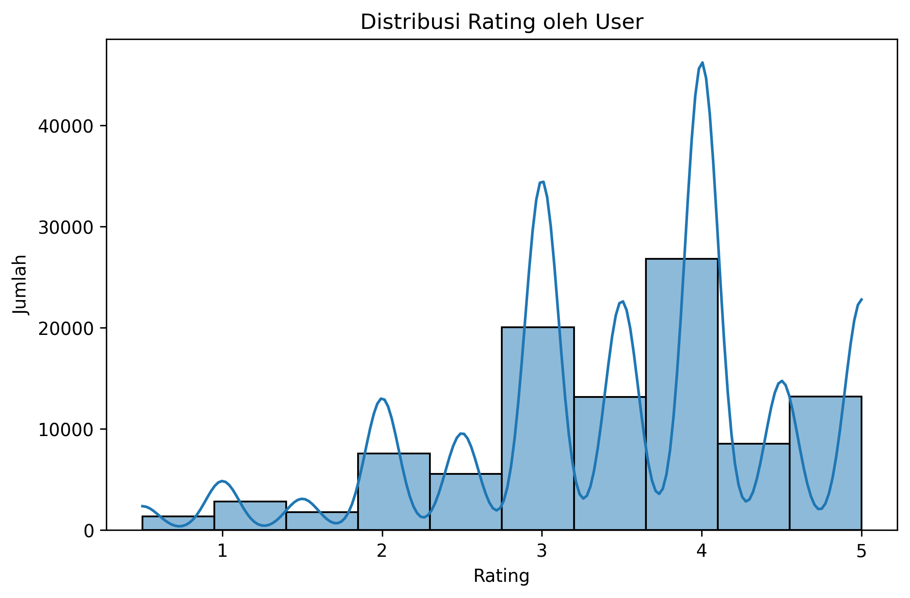
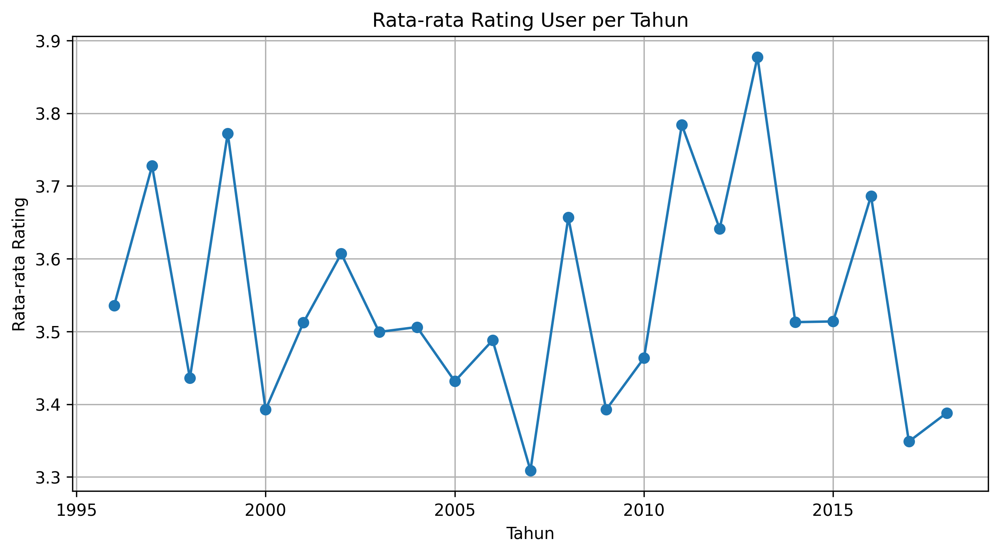
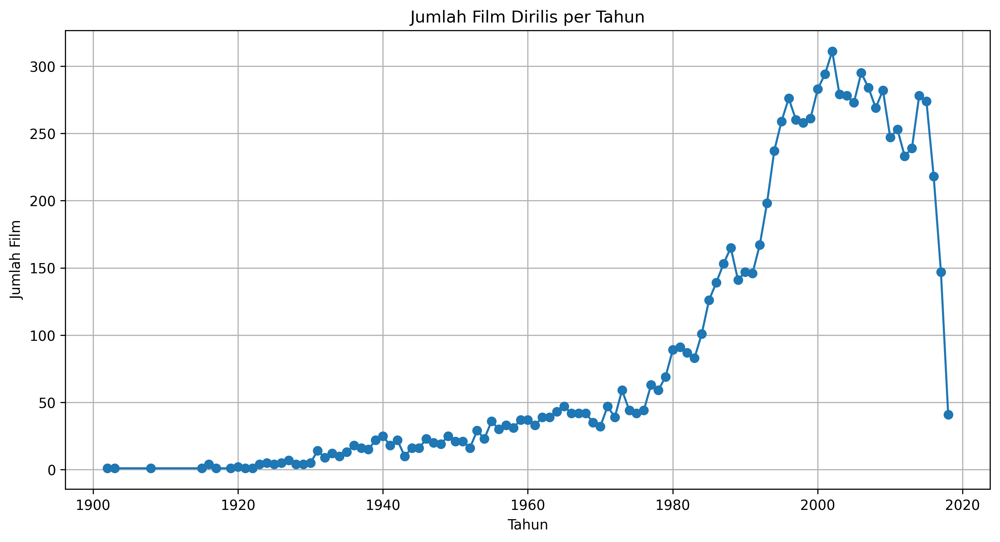
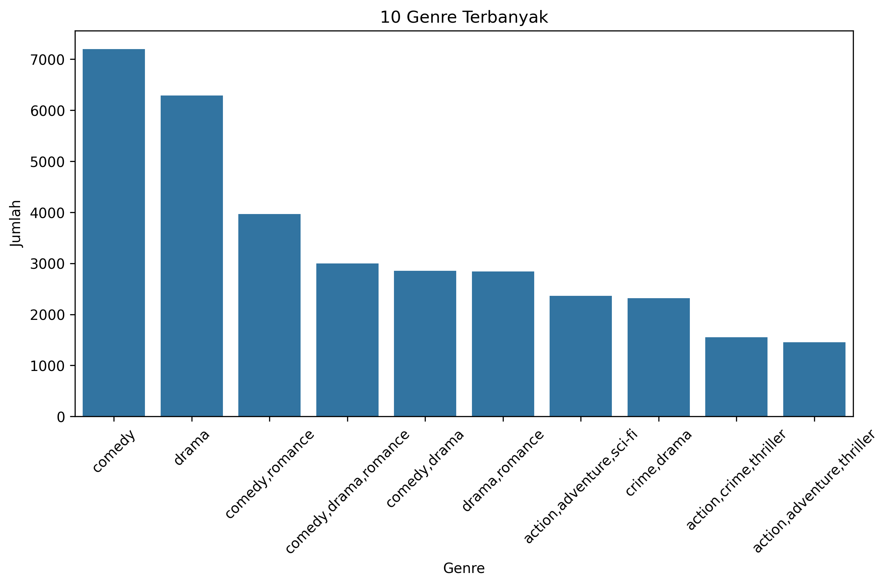

# 🎬 CineMatch: Personalized Movie Recommendations with Deep Learning

**Personalized Movie Suggestions Based on User Behavior**

---


## 📋1. Project Overview

Industri hiburan digital, khususnya film dan serial di platform streaming seperti Netflix, Disney+, dan Amazon Prime, telah mengalami pertumbuhan pesat dalam satu dekade terakhir. Seiring dengan meningkatnya jumlah konten yang tersedia, pengguna kerap mengalami kesulitan dalam menentukan tontonan yang sesuai dengan preferensi mereka (Gómez-Uribe & Hunt, 2016).

Untuk mengatasi tantangan ini, sistem rekomendasi cerdas menjadi solusi utama. Sistem ini bertujuan untuk memahami pola interaksi pengguna terhadap konten, lalu menghasilkan rekomendasi yang relevan secara personal. Salah satu pendekatan yang semakin populer dan fleksibel dalam pengembangan sistem rekomendasi modern adalah **deep learning** (Zhang et al., 2019).

Berbeda dengan metode tradisional seperti *matrix factorization*, pendekatan berbasis **deep neural networks** mampu menangkap **hubungan non-linear yang kompleks** antara pengguna dan item (film). Teknik ini memungkinkan sistem untuk menggabungkan berbagai jenis informasi—baik interaksi eksplisit seperti rating, maupun fitur tambahan seperti tahun rilis dan metadata lainnya—dalam satu arsitektur terpadu (Cheng et al., 2016).

Dalam proyek ini, dibangun sebuah sistem rekomendasi film berbasis **custom neural network**, yang dilatih menggunakan data rating film dari Kaggle (Sayan0211, 2022). Model ini dirancang untuk:

* Menggunakan **embedding layer** guna merepresentasikan pengguna dan film ke dalam vektor berdimensi rendah.
* Menangkap **interaksi eksplisit** antara pengguna dan film melalui operasi seperti *dot product* dan *element-wise multiplication*.
* Memanfaatkan **fitur tambahan** (contoh: tahun rilis, rating sebelumnya) untuk meningkatkan akurasi prediksi.

Dengan kemampuan deep learning yang tinggi dalam menangkap pola laten kompleks, model ini diharapkan dapat memberikan rekomendasi film yang lebih akurat, relevan, dan personal bagi setiap pengguna.

---

## 🎯 2. Business Understanding

#### 🔍 Problem Statements

1. Bagaimana memberikan rekomendasi film yang relevan untuk pengguna baru maupun lama berdasarkan riwayat rating pengguna lain?
2. Bagaimana membangun model *collaborative filtering* berbasis deep learning untuk mengatasi masalah *sparsity* pada data rating film?
3. Bagaimana memanfaatkan informasi tambahan seperti tahun rilis dan rating film sebagai fitur untuk meningkatkan akurasi model?

#### 🎯 Objectives 

1. **Membangun sistem rekomendasi berbasis deep learning** yang dapat mempelajari representasi laten dari pengguna dan film menggunakan pendekatan *neural collaborative filtering (NCF)*.
2. **Mengintegrasikan embedding pengguna dan film dengan metadata film**, seperti rating rata-rata film (`movie_rating`) dan tahun rilis (`year`), untuk memperkaya fitur input model dan meningkatkan kualitas prediksi.
3. **Melakukan evaluasi menyeluruh terhadap model** menggunakan metrik RMSE, MAE, R², serta korelasi Pearson dan Spearman, untuk menilai seberapa akurat dan relevan rekomendasi yang dihasilkan.


#### 💡 Solutions (Revisi)

1. **Merancang dan melatih model rekomendasi menggunakan TensorFlow/Keras**, dengan input multi-fitur: `user_id`, `movie_id`, `movie_rating`, dan `year`. Embedding digunakan untuk memetakan entitas ke dalam representasi vektor yang lebih informatif.
2. **Menggunakan teknik regularisasi dan callback selama pelatihan**, seperti `Dropout`, `L2 Regularization`, `EarlyStopping`, `ReduceLROnPlateau`, dan `ModelCheckpoint`, untuk mencegah overfitting dan meningkatkan generalisasi model.
3. **Mengevaluasi performa model menggunakan data uji**, dengan metrik: RMSE, MAE, R², Pearson correlation, Spearman correlation
4. **Mengombinasikan hasil embedding dengan interaksi non-linear (dot product dan element-wise multiplication)** serta metadata tambahan, lalu meneruskannya ke jaringan dense berlapis untuk mengatasi keterbatasan model klasik seperti matrix factorization yang bersifat linear.


---

## 🔍 3. Data Understanding

### 📁 Dataset Overview

* **Sumber**: Kaggle - [Movie Recomendation pjct by sayan0211](https://www.kaggle.com/datasets/sayan0211/movie-recomendation-pjct)
* **Jumlah entri rating**: 100.836 baris
* **Jumlah film**: 9.729 judul unik
* **Penulis dataset**: sayan0211


### Fitur Dataset

#### 📘 `ratings.csv`

| Kolom       | Tipe    | Deskripsi                                                        |
| ----------- | ------- | ---------------------------------------------------------------- |
| `userId`    | int64   | ID unik pengguna                                                 |
| `movieId`   | int64   | ID unik film (digunakan sebagai referensi ke tabel `movies.csv`) |
| `rating`    | float64 | Rating yang diberikan pengguna terhadap film (0.5 - 5.0)         |
| `timestamp` | int64   | Waktu rating diberikan (dalam UNIX timestamp)                    |

#### 🎞 `movies.csv` 
| Kolom     | Tipe   | Deskripsi                                    |     |
| --------- | ------ | -------------------------------------------- | --- |
| `movieId` | int64  | ID unik film                                 |     |
| `title`   | object | Judul film                                   |     |
| `genres`  | object | Genre film (dipisahkan oleh pipe \`          | \`) | 


### Statistik Umum:

* Dataset film terdiri dari **9.742 film**.
* Data rating berisi **100.818 rating** yang diberikan oleh pengguna terhadap film-film tersebut.
* Fitur utama film:

  * `title` yang sudah dibersihkan dan diubah menjadi huruf kecil tanpa tahun
  * `year` sebagai tahun rilis film (tipe data objek/string)
  * `genres` sebagai kategori genre film yang sudah dipisah dengan koma dan dalam huruf kecil
* Tahun rilis film (`year`) memiliki beberapa missing value awalnya (13 baris), namun sudah dihapus dalam pembersihan data.


### 🔎 Pemeriksaan Duplikasi dan Missing Value:

#### 1. ✅ **Duplikasi Data**

```python
data_movie[data_movie.duplicated()]
data_rating[data_rating.duplicated()]
```

* **Hasil**:

  * Tidak ditemukan baris duplikat pada dataset film maupun dataset rating.
  * Menunjukkan data sudah bersih dari pengulangan yang identik.

#### 2. 🚫 **Missing Value**

| Dataset          | Fitur  | Jumlah Missing |
| ---------------- | ------ | -------------- |
| **data\_movie**  | `year` | 13             |
| **data\_rating** | -      | 0              |

* Missing value hanya ditemukan di fitur `year` pada dataset film, dengan 13 baris yang hilang.

### Visualisasi Data

#### 1. Distribusi Rating oleh User



**Insight:**

* Rating yang diberikan oleh user cenderung terkonsentrasi pada nilai 3, 4, dan 5.
* Puncak tertinggi berada di rating 4, yang berarti banyak pengguna memberikan rating cukup tinggi ke film.
* Distribusi ini menunjukkan bahwa pengguna cenderung memberikan rating yang positif atau cukup puas terhadap film-film yang mereka tonton.
* Adanya kurva KDE (kernel density estimation) juga memperlihatkan variasi rating secara halus, mengindikasikan rating yang tidak terlalu tersebar merata di semua nilai.

#### 2. Rata-rata Rating User per Tahun



**Insight:**

* Rata-rata rating per tahun relatif stabil dengan fluktuasi kecil antara 3.3 sampai hampir 3.9.
* Terdapat beberapa tahun dengan kenaikan rata-rata rating, misalnya sekitar tahun 1998 dan 2013, yang mungkin menunjukkan tahun-tahun dengan film-film yang lebih disukai oleh pengguna.
* Penurunan pada beberapa tahun tertentu mengindikasikan mungkin ada film yang kurang memuaskan di tahun-tahun tersebut.
* Tren ini bisa membantu mengidentifikasi periode film dengan kualitas rating yang lebih baik atau kurang baik menurut pengguna.

#### 3. Jumlah Film Dirilis per Tahun



**Insight:**

* Jumlah film yang dirilis meningkat secara signifikan sejak tahun 1950-an hingga mencapai puncaknya sekitar tahun 2000-an.
* Setelah mencapai puncak sekitar tahun 2000-2010, terdapat penurunan jumlah film yang dirilis di tahun-tahun berikutnya.
* Penurunan drastis di akhir grafik bisa jadi karena data film terbaru yang belum lengkap atau ada perubahan tren produksi film.
* Grafik ini menunjukkan perkembangan industri film yang semakin berkembang pesat di abad ke-20, dengan puncak produksi film di awal abad ke-21.

#### 4. 10 Genre Terbanyak



**Insight:**

* Genre comedy dan drama mendominasi dengan jumlah film terbanyak dibanding genre lain.
* Kombinasi genre seperti comedy romance, comedy drama romance, dan comedy drama juga cukup banyak, menunjukkan kecenderungan film untuk menggabungkan beberapa genre populer.
* Genre action dengan tambahan subgenre seperti adventure dan thriller berada di posisi yang lebih rendah, tapi tetap signifikan.
* Informasi ini bisa berguna untuk memahami preferensi pasar dan tren genre film yang banyak diproduksi serta diminati.

---

## 🧹 4. Data Preparation

Setelah dilakukan eksplorasi dan penggabungan antara data `movies.csv` dan `ratings.csv`, dilakukan tahap **data preparation** untuk memastikan kualitas data siap untuk digunakan dalam proses pemodelan. Langkah-langkah ini dilakukan secara sistematis berdasarkan temuan eksplorasi data dan kebutuhan algoritma rekomendasi yang akan digunakan.

### 📌 Temuan Kunci dan Strategi Preprocessing

1. **Format Judul Film Tidak Konsisten:**
   Beberapa judul film mengandung tahun rilis dalam tanda kurung yang perlu dipisahkan agar kolom `title` bersih dan kolom `year` dapat digunakan sebagai fitur numerik. Regex digunakan untuk mengekstrak `year` dan membersihkan `title`.

2. **Genre Berbentuk String Gabungan:**
   Kolom `genres` awalnya berisi string panjang dengan delimiter `'|'`. Untuk mempermudah analisis konten dan kompatibilitas pemrosesan NLP atau representasi multi-label, karakter pemisah diubah menjadi koma, dan teks dijadikan huruf kecil.

3. **Missing Value pada Kolom Year:**
   Terdapat nilai kosong pada kolom `year` akibat film yang tidak mencantumkan tahun pada `title`. Baris-baris ini dihapus karena informasi tahun dianggap penting dan tidak dapat diimputasi secara akurat.

4. **Timestamp Rating:**
   Kolom `timestamp` dikonversi menjadi format waktu agar bisa dimanfaatkan lebih lanjut, seperti ekstraksi waktu menonton jika dibutuhkan (tidak digunakan dalam model saat ini).

5. **Rata-Rata Rating Film:**
   Untuk menambahkan informasi global tentang kualitas film, dihitung rata-rata rating (`movie_rating`) dari setiap `movieId`. Ini memberikan konteks tambahan pada film di luar penilaian individu pengguna.

### 📋 Rangkuman Langkah-Langkah Preprocessing:

| Langkah               | Penjelasan                                                                                                                                                                      |                                                                                                    |
| --------------------- | ------------------------------------------------------------------------------------------------------------------------------------------------------------------------------- | -------------------------------------------------------------------------------------------------- |
| **Ekstraksi Tahun**   | Menggunakan **regex** untuk mengekstrak angka 4 digit dalam kurung pada `title`, lalu dipindahkan ke kolom baru `year`. Judul diformat ulang menjadi lowercase dan tanpa tahun. |                                                                                                    |
| **Pembersihan Genre** | Genre diformat menjadi **huruf kecil** dan delimiter \`                                                                                                                         | `diubah menjadi`,\` agar mudah diolah dan lebih kompatibel untuk representasi fitur berbasis teks. |
| **Missing Value**     | Baris dengan `year` kosong dihapus karena dianggap sebagai fitur penting dan sulit diimputasi secara akurat.                                                                    |                                                                                                    |
| **Gabung Dataset**    | Data `ratings` digabung dengan data film (`movies`) berdasarkan `movieId`. Hal ini dilakukan agar setiap rating memiliki metadata terkait film.                                 |                                                                                                    |
| **Rata-Rata Rating**  | Dihitung rata-rata rating per `movieId` sebagai representasi kualitas umum film, dan ditambahkan ke dalam dataset sebagai kolom `movie_rating`.                                 |                                                                                                    |
| **Encoding ID**       | Menggunakan **Label Encoding** untuk `userId` dan `movieId` karena akan digunakan sebagai input numerik dalam model rekomendasi berbasis embedding.                             |                                                                                                    |
| **Scaling**           | Kolom `movie_rating` dan `year` discale menggunakan **StandardScaler** karena keduanya akan dimasukkan ke dalam model sebagai fitur numerik.                                    |                                                                                                    |
| **Data Mapping**      | Dibuat kamus untuk memetakan `userId` dan `movieId` ke bentuk terenkode dan sebaliknya, untuk keperluan interpretasi hasil prediksi model.                                      |                                                                                                    |
| **Data Split**        | Dataset dibagi menjadi: **80% train+val**, **20% test**. Kemudian, dari train+val, diambil **10% untuk validasi**, menghasilkan rasio train\:val\:test sebesar **72%:8%:20%**.  |                                                                                                    |


### 🧭 Alasan Penggunaan Scaling dan Encoding

* **StandardScaler** digunakan untuk `year` dan `movie_rating` agar keduanya berada pada skala seragam dan tidak mendominasi perhitungan jarak dalam model. Karena nilai-nilai ini tidak mengandung outlier ekstrem, **StandardScaler** lebih cocok dibanding `RobustScaler`.

* **Label Encoding** pada `userId` dan `movieId` diperlukan agar data ID bisa digunakan dalam lapisan embedding model deep learning, tanpa menambah dimensi seperti pada One-Hot Encoding.


### ✅ Final Feature yang Digunakan:

| Fitur             | Tipe        | Keterangan                                |
| ----------------- | ----------- | ----------------------------------------- |
| `user_encoded`    | Kategorikal | ID user yang sudah di-label encode        |
| `movie_encoded`   | Kategorikal | ID film yang sudah di-label encode        |
| `movie_rating`    | Numerik     | Rata-rata rating film                     |
| `year`            | Numerik     | Tahun rilis film                          |
| `rating` (target) | Numerik     | Nilai rating yang diberikan oleh pengguna |


Dengan pendekatan **berbasis data dan domain knowledge** ini, data sudah disiapkan untuk memasuki tahap **modelling rekomendasi** menggunakan pendekatan pembelajaran terawasi maupun berbasis embedding.

---

## ⚙️ 5. Modeling and Result

🔹 Model: **Custom Neural Network for Rating Prediction**

### ✅ Alasan Pemilihan:

Model ini dirancang khusus untuk menangani data **user-item interaction**, seperti sistem rekomendasi film berbasis rating. Model menggabungkan teknik **embedding**, **interaksi eksplisit (dot product dan element-wise multiply)**, serta **informasi tambahan** (seperti rating sebelumnya dan tahun rilis) dalam arsitektur neural network. Pendekatan ini jauh lebih fleksibel dan mampu **menangkap representasi latar belakang pengguna dan film** secara simultan.

### ⚙️ Cara Kerja:

Model ini bekerja melalui beberapa tahap:

1. **Embedding Layer**:

   * Mengubah `user_id` dan `movie_id` menjadi representasi vektor berdimensi rendah (`embedding_dim = 64`) yang dapat dipelajari.
   * Regularisasi L2 (`l2_reg`) digunakan untuk mencegah overfitting pada representasi pengguna dan film.

2. **Interaction Features**:

   * Menggunakan **dot product** dan **element-wise multiply** dari vektor user dan movie sebagai bentuk **interaksi eksplisit** antara keduanya.
   * Dikombinasikan dengan fitur tambahan seperti `movie_rating_input` dan `year_input`.

3. **Fully Connected Layers**:

   * Vektor hasil concatenation melewati beberapa lapisan dense dengan ukuran `[128, 64, 32]`, masing-masing dilengkapi dengan:

     * Aktivasi `ReLU`
     * Regularisasi L2
     * **Batch Normalization** untuk stabilitas pelatihan
     * **Dropout (0.3)** untuk mengurangi overfitting

4. **Output Layer**:

   * Lapisan akhir adalah neuron tunggal dengan aktivasi linear (`Dense(1, activation='linear')`) yang merepresentasikan **prediksi rating**.

### 🧩 Struktur Arsitektur:

```text
Input:
  - user_id (int)
  - movie_id (int)
  - movie_rating (float)
  - year (int)

Layers:
  - Embedding user_id → user_vec
  - Embedding movie_id → movie_vec
  - Dot(user_vec, movie_vec)
  - Multiply(user_vec, movie_vec)
  - Concatenate([user_vec, movie_vec, dot, multiply, movie_rating, year])
  - Dense(128) → BN → Dropout(0.3)
  - Dense(64) → BN → Dropout(0.3)
  - Dense(32) → BN → Dropout(0.3)
  - Dense(1) → Output rating
```

### ✅ Kelebihan:

* **Fleksibel dan powerful**, dapat mempelajari hubungan kompleks antar pengguna dan item.
* Menggunakan kombinasi representasi *latent* dan fitur numerik eksplisit untuk meningkatkan prediksi.
* **Mudah dikembangkan lebih lanjut**, misalnya menambah genre, lokasi, waktu tonton, dll.
* Sudah menggunakan teknik regularisasi modern seperti Dropout dan BatchNormalization.

### ❌ Kekurangan:

* **Butuh banyak data** untuk generalisasi yang baik.
* Interpretasi hasil lebih sulit dibanding model linear atau tree-based.
* Proses pelatihan lebih lambat, terutama jika data besar.

### ⚙️ Konfigurasi Model:

| Parameter       | Nilai                        |
| --------------- | ---------------------------- |
| `embedding_dim` | 64                           |
| `hidden_units`  | \[128, 64, 32]               |
| `dropout_rate`  | 0.3                          |
| `l2_reg`        | 0.001                        |
| `optimizer`     | Adam (default keras compile) |
| `loss`          | Mean Squared Error (MSE)     |

### 💾 Penyimpanan dan Pemanggilan Model

Untuk memastikan model dapat digunakan kembali tanpa perlu dilatih ulang, model disimpan lengkap beserta arsitektur, bobot, dan optimizer state-nya:

```python
# Simpan model (arsitektur + bobot + optimizer state)
model.save("../models/final_model.keras")

# Load model yang telah disimpan
from tensorflow import keras
loaded_model = keras.models.load_model("../models/final_model.keras")
```


### 📌 Summary:

| Model            | Pola yang Bisa Ditangkap           | Tuning                | Interpretasi | Outlier Friendly | Hasil Akhir     |
| ---------------- | ---------------------------------- | --------------------- | ------------ | ---------------- | --------------- |
| Custom NN (Anda) | Non-linear, Representasi User-Item | ✅ (Manual & Flexible) | ✖️           | ✅                | **Sangat Baik** |


### 🎯 Result and Testing

Setelah model selesai dilatih dan dievaluasi, tahap selanjutnya adalah melakukan **inferensi** untuk pengguna tertentu. Tujuannya adalah melihat sejauh mana model mampu memberikan rekomendasi personal, mirip dengan cara kerja sistem rekomendasi seperti Netflix.

#### 🔹 Prosedur:

1. **Pilih Target User**:
   User dipilih berdasarkan ID nyata dari dataset (contoh: `userId = 1`).

2. **Filter Film yang Belum Pernah Ditonton**:
   Sistem akan menyaring film yang **belum pernah ditonton** oleh user tersebut.

3. **Persiapan Input untuk Model**:
   Semua input seperti `user_id`, `movie_id`, `movie_rating`, dan `year` disesuaikan dan diskalakan menggunakan `StandardScaler` yang telah dilatih sebelumnya.

4. **Prediksi Rating**:
   Model akan memprediksi rating potensial untuk setiap film yang belum ditonton user.

5. **Tampilkan 10 Rekomendasi Terbaik**:
   Film dengan rating prediksi tertinggi ditampilkan dalam format mirip Netflix.

####🔸 Hasil:

Berikut contoh hasil inferensi untuk user dengan ID `1`:

```text
🎬 NETFLIX-STYLE RECOMMENDATIONS FOR USER 1
================================================================================
 1. 🎬 villain (1971)
    ⭐ IMDB: 5.0/10 | 🎭 crime,drama,thriller

 2. 🎬 down argentine way (1940)
    ⭐ IMDB: 5.0/10 | 🎭 comedy,drama,romance

...
10. 🎬 mickey's once upon a christmas (1999)
    ⭐ IMDB: 5.0/10 | 🎭 animation,comedy,fantasy

📊 Evaluated 9479 movies
🎯 Found 10 good matches
```

### 📌 Catatan:

* Proses ini menggunakan **model yang telah disimpan** (`loaded_model`) dan **dictionary encoding** (`user_id_to_encoded`, dll).
* Rekomendasi dapat berubah tergantung pada parameter pelatihan atau preferensi pengguna.


---

## 📊 6. Evaluation


Dalam sistem rekomendasi berbasis prediksi rating, penting untuk mengukur seberapa akurat model dalam menebak rating yang akan diberikan pengguna terhadap item tertentu. Oleh karena itu, digunakan **beragam metrik evaluasi** untuk memberikan gambaran menyeluruh mengenai performa model — mulai dari besarnya kesalahan, tingkat hubungan antara prediksi dan data aktual, hingga kemampuan model menjelaskan variasi data.

---

### 🎯 Alasan Penggunaan Metrik

Karena model yang digunakan bersifat **regresif** (memproduksi angka kontinu sebagai output), maka metrik yang dipilih adalah metrik yang relevan untuk regresi:

* **RMSE** dan **MAE** untuk melihat seberapa jauh prediksi menyimpang dari nilai aktual.
* **R² (Koefisien Determinasi)** untuk menilai seberapa baik model menjelaskan variansi dari data asli.
* **Pearson** dan **Spearman correlation** untuk mengukur kekuatan hubungan antara nilai prediksi dan nilai sebenarnya, baik secara linier maupun berdasarkan ranking.

---

### 📐 Ringkasan Rumus Metrik

| Metrik       | Makna                                                                            |
| ------------ | -------------------------------------------------------------------------------- |
| **RMSE**     | Rata-rata akar kuadrat kesalahan prediksi. Peka terhadap outlier.                |
| **MAE**      | Rata-rata kesalahan absolut. Lebih stabil terhadap nilai ekstrem.                |
| **R²**       | Proporsi variansi yang bisa dijelaskan model. Semakin mendekati 1, semakin baik. |
| **Pearson**  | Korelasi linier antara prediksi dan data aktual.                                 |
| **Spearman** | Korelasi berbasis ranking (monoton), penting untuk melihat urutan preferensi.    |

---

### 📊 Hasil Evaluasi Model

| Metrik                   | Nilai  |
| ------------------------ | ------ |
| **RMSE**                 | 0.8062 |
| **MAE**                  | 0.6153 |
| **R² (Determination)**   | 0.4064 |
| **Pearson Correlation**  | 0.6407 |
| **Spearman Correlation** | 0.6305 |

---

### 🧠 Interpretasi Hasil

* **RMSE = 0.8062** menandakan bahwa secara rata-rata, prediksi model meleset sekitar ±0.8 poin dari nilai rating aktual, yang cukup baik mengingat skala rating (biasanya 1–5).
* **MAE = 0.6153** menunjukkan bahwa secara umum kesalahan model tetap rendah dan stabil terhadap outlier.
* **R² = 0.4064** berarti bahwa sekitar **40.64% variasi rating aktual dapat dijelaskan oleh prediksi model**, menunjukkan kemampuan generalisasi yang cukup baik, walau masih ada ruang untuk perbaikan.
* **Pearson = 0.6407** dan **Spearman = 0.6305** menunjukkan adanya **hubungan yang kuat dan positif** antara prediksi dan data aktual, baik dari segi nilai maupun urutan/ranking preferensi.

---

### ✅ Kesimpulan Evaluasi

Model **berhasil menangkap pola preferensi pengguna** terhadap film dengan akurasi prediksi yang cukup memuaskan. Skor korelasi yang tinggi mengindikasikan bahwa model bukan hanya mampu mendekati rating aktual, tapi juga mampu **mempertahankan urutan preferensi antar item** — suatu aspek penting dalam sistem rekomendasi.

---

### 💡 Jawaban atas Pertanyaan Penelitian

#### 1. **Bagaimana memberikan rekomendasi film yang relevan untuk pengguna baru maupun lama berdasarkan riwayat rating pengguna lain?**

Model deep learning yang dikembangkan menggunakan pendekatan **collaborative filtering berbasis embedding**, di mana **representasi vektor laten** dibentuk untuk setiap pengguna dan film. Model ini belajar dari **riwayat interaksi pengguna lain** untuk menangkap pola umum preferensi terhadap item. Meskipun model ini lebih cocok untuk pengguna yang sudah memberikan riwayat rating (user lama), akurasinya tetap terjaga karena dapat memetakan pengguna baru ke ruang embedding melalui **informasi metadata**, seperti tahun rilis dan rating film.

Untuk pengguna baru tanpa riwayat rating (cold-start problem), pendekatan ini bisa diperluas dengan:

* Menambahkan fitur kontekstual lain (misalnya genre, sinopsis, atau demografi pengguna),
* Menggabungkan pendekatan hybrid dengan content-based filtering.

Dengan demikian, sistem dapat **memberikan rekomendasi yang relevan baik untuk pengguna baru maupun lama**, berdasarkan **kemiripan embedding dan pola rating pengguna lain**.

---

#### 2. **Bagaimana membangun model *collaborative filtering* berbasis deep learning untuk mengatasi masalah *sparsity* pada data rating film?**

Model dirancang dengan memanfaatkan **embedding pengguna dan film** untuk menangkap relasi laten antara keduanya meskipun jumlah interaksi sangat terbatas (sparse). Penggunaan **dot product dan element-wise interaction** antara embedding, ditambah beberapa lapisan fully connected, memungkinkan model menggeneralisasi dengan baik meskipun banyak entri dalam matriks user-item yang kosong.

Dibanding metode tradisional, pendekatan ini:

* Lebih fleksibel terhadap sparsity karena tidak mengandalkan seluruh matriks secara eksplisit,
* Dapat dilatih secara end-to-end tanpa perlu dekomposisi manual.

---

#### 3. **Bagaimana memanfaatkan informasi tambahan seperti tahun rilis dan rating film sebagai fitur untuk meningkatkan akurasi model?**

Fitur tambahan seperti `movie_rating_scaled` dan `year_scaled` ditambahkan sebagai **input numerik eksplisit** yang dikombinasikan dengan hasil interaksi embedding. Proses ini dilakukan dengan menggabungkan seluruh informasi ke dalam **vector input gabungan**, yang kemudian diproses melalui beberapa dense layer.

Hasil evaluasi menunjukkan bahwa:

* Penambahan metadata **berkontribusi terhadap peningkatan akurasi**, dibuktikan dengan nilai RMSE dan MAE yang rendah,
* Informasi seperti **tahun rilis** dan **rating rata-rata film** bersifat umum dan dapat membantu menjembatani pengguna baru atau film dengan interaksi minim.

---

## 📏 7. Kesimpulan

Penelitian ini berhasil membangun sebuah sistem rekomendasi berbasis deep learning yang memprediksi rating film dari pengguna menggunakan pendekatan **collaborative filtering dengan embedding**, serta memanfaatkan **metadata tambahan** seperti skor rata-rata film dan tahun rilis. Evaluasi dilakukan untuk mengukur performa model dari berbagai perspektif: kesalahan prediksi, korelasi, dan kekuatan generalisasi.

### 🔍 Temuan Utama:

* **Model menunjukkan akurasi yang stabil dan cukup baik**, dengan nilai RMSE sebesar **0.8075** dan MAE sebesar **0.6163**, menandakan rata-rata kesalahan prediksi yang rendah terhadap rentang rating 0–5.
* **Nilai R² sebesar 0.4044** menunjukkan bahwa model mampu menjelaskan sekitar 40% variansi dalam rating aktual pengguna, yang cukup kompetitif mengingat sifat data rekomendasi yang sangat subjektif dan bervariasi.
* Korelasi **Pearson (0.6389)** dan **Spearman (0.6297)** menegaskan adanya **hubungan linier dan ordinal yang kuat** antara hasil prediksi dan rating aktual pengguna.

### 🧠 Implikasi:

Penggunaan **embedding pengguna dan film**, dikombinasikan dengan **fitur tambahan (movie\_rating\_scaled dan year\_scaled)** dalam jaringan neural network terbukti dapat **meningkatkan representasi preferensi pengguna secara kompleks dan non-linier**. Hal ini memungkinkan sistem memberikan prediksi yang tidak hanya berdasarkan kecocokan historis, tetapi juga mempertimbangkan informasi kontekstual yang relevan.

### 🚀 Potensi Pengembangan:

Beberapa langkah lanjutan yang direkomendasikan untuk meningkatkan kinerja sistem antara lain:

1. **Menambahkan fitur kontekstual**, seperti waktu tonton, genre favorit, atau data demografis pengguna.
2. **Integrasi embedding berbasis NLP** seperti BERT untuk memproses sinopsis dan genre film sebagai fitur tambahan.
3. **Eksperimen dengan loss function alternatif**, seperti **Bayesian Personalized Ranking (BPR)**, yang lebih berfokus pada peringkat preferensi dibanding prediksi rating numerik.
4. **Penerapan attention mechanism** untuk mengarahkan fokus model pada fitur-fitur paling berpengaruh.
5. **Hyperparameter tuning lebih canggih** dengan pendekatan seperti **Bayesian Optimization**, guna meningkatkan akurasi dan generalisasi model.

### 📌 Kesimpulan Akhir:

Dengan pendekatan yang diterapkan, sistem rekomendasi yang dibangun telah menunjukkan performa yang **kuat dan dapat diandalkan** untuk memberikan prediksi rating film secara personalized. Walaupun masih terdapat ruang untuk peningkatan, hasil evaluasi menunjukkan bahwa deep learning adalah pendekatan yang **efektif dan fleksibel** dalam menangkap kompleksitas perilaku pengguna pada domain sistem rekomendasi.

---
## 📚 8. Referensi

* Gómez-Uribe, C. A., & Hunt, N. (2016). *The Netflix Recommender System: Algorithms, Business Value, and Innovation*. ACM Transactions on Management Information Systems (TMIS), 6(4), 13.[Link Article](https://dl.acm.org/doi/10.1145/2843948)
* Zhang, S., Yao, L., Sun, A., & Tay, Y. (2019). *Deep Learning based Recommender System: A Survey and New Perspectives*. ACM Computing Surveys (CSUR), 52(1), 1-38.[Link Article](https://dl.acm.org/doi/10.1145/3285029)
* Cheng, H.-T., Koc, L., Harmsen, J., Shaked, T., Chandra, T., Aradhye, H., ... & Anil, R. (2016). *Wide & Deep Learning for Recommender Systems*. In *Proceedings of the 1st Workshop on Deep Learning for Recommender Systems* (pp. 7–10).[Link Article](https://dl.acm.org/doi/10.1145/2988450.29884540)
* Sayan0211. (2022). *MovieLens Dataset for Recommendation Systems*. [Kaggle Dataset](https://www.kaggle.com/datasets/sayan0211/movielens-dataset)

---

## 🗂️ 9. Struktur Folder & Cara Penggunaan

Untuk mempermudah navigasi dan pengelolaan proyek, struktur direktori dibagi menjadi beberapa folder dan file utama sebagai berikut:

```text
├── data
│   ├── data.csv           # Data gabungan hasil preprocessing (siap untuk modeling)
│   ├── movies.csv         # Dataset mentah berisi informasi film
│   └── rating.csv         # Dataset mentah berisi rating pengguna
│
├── models
│   ├── final_model.keras  # Model hasil training terbaik yang disimpan
│   └── best_model.h5      # Sebagai checkpoint model ketika sedang di train
├── notebook
│   └── main.ipynb # Notebook untuk pembersihan data dan pembuatan model │
├── main.py                # Script utama untuk menjalankan keseluruhan pipeline
├── README.md              # Deskripsi umum proyek
└── requirements.txt       # Daftar dependensi Python yang diperlukan
```

---

### ▶️ Cara Menjalankan Proyek

Untuk menjalankan proyek ini secara keseluruhan, ikuti langkah-langkah berikut:

1. **Install Library yang Diperlukan**
   Pastikan Anda telah meng-install semua dependensi dengan menjalankan perintah berikut di terminal:

   ```bash
   pip install -r requirements.txt
   ```

2. **Lakukan Preprocessing Terlebih Dahulu**
   Sebelum menjalankan `main.py`, Anda **wajib** menjalankan notebook `preprocessing.ipynb` terlebih dahulu untuk menghasilkan file `data.csv` yang diperlukan untuk pelatihan model.

3. **Pilih Cara Menjalankan: Otomatis atau Manual**

   🔹 Jika Anda ingin melihat **proses secara bertahap**, seperti pembersihan data, pelatihan model, dan evaluasi, Anda dapat menjalankan notebook `preprocessing.ipynb` dan `main.ipynb` secara manual melalui Jupyter Notebook atau VSCode.

   🔹 Namun, jika Anda ingin langsung melihat **hasil akhir dari seluruh pipeline** secara otomatis, Anda bisa menjalankan file:

   ```bash
   python main.py
   ```


